# Lumma Stealer Network Traffic Analysis


---
## Attack Flow

```
Victim (10.6.26.101)
        │
        │ DNS Query
        ▼
    genhqq.xyz
        │
        │ TLS (443)
        ▼
144.172.115.212 (C2)
        │
        │ HTTP Download
        ▼
    86.54.25.50
        │
        ▼
     soks.exe
```

---

## Overview

This project presents a forensic network traffic analysis of a Lumma Stealer malware infection using Wireshark. The objective was to identify the infection process, analyze network communications, recover Indicators of Compromise (IoCs), and observe how the malware communicated with its Command-and-Control (C2) infrastructure.

---

## Analysis Objectives

- Identify the malware communication flow.
- Extract network-based Indicators of Compromise (IoCs).
- Analyze DNS, TCP, and TLS communications.
- Identify the Command-and-Control (C2) infrastructure.
- Recover the downloaded malware payload.
- Document the attack timeline.

---

## Repository Structure

```
.
├── README.md
├── images/
│   ├── 01_protocol_hierarchy.png
│   ├── ...
│   └── 18_tcp_endpoints.png
└── pcap/
    └── 2025-06-26-Lumma-Stealer-infection-with-follow-up-malware.pcap
```

---

## Tools Used

- Wireshark
- VirusTotal
- Any.Run
- Hybrid Analysis

---

## Indicators of Compromise (IoCs)

| Indicator | Value |
|-----------|-------|
| Malware | Lumma Stealer |
| Domain | genhqq.xyz |
| C2 IP | 144.172.115.212 |
| Download Host | 86.54.25.50 |
| Downloaded File | soks.exe |
| Protocol | HTTPS |
| Port | TCP/443 |

---

## Protocol Hierarchy

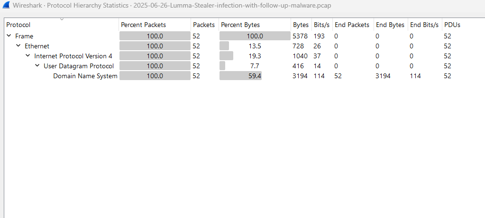

The Protocol Hierarchy statistics provide an overview of all protocols observed in the filtered capture. The communication consists entirely of IPv4 traffic over TCP with TLS encryption. This confirms that the malware communicates using encrypted HTTPS sessions.

---

## IPv4 Endpoints

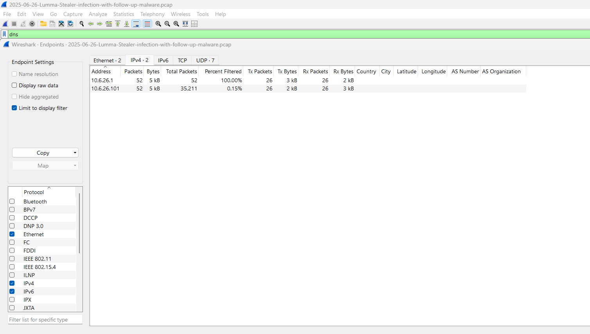

The IPv4 Endpoints statistics identify all communicating hosts during the malicious session. The infected workstation (10.6.26.101) communicates primarily with the remote Command-and-Control server (144.172.115.212).

---

## IPv4 Conversations

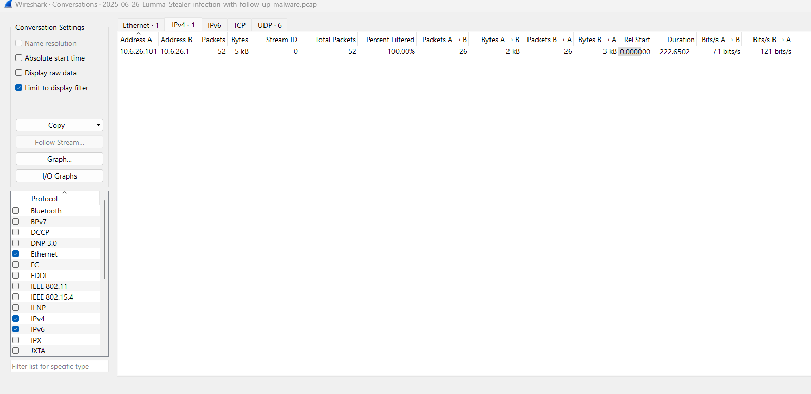

The IPv4 Conversations view summarizes the bidirectional communication between the infected host and the remote system. Only a single conversation is present within the applied filter, confirming the isolated analysis of the malicious connection.

---

## Command-and-Control Communication

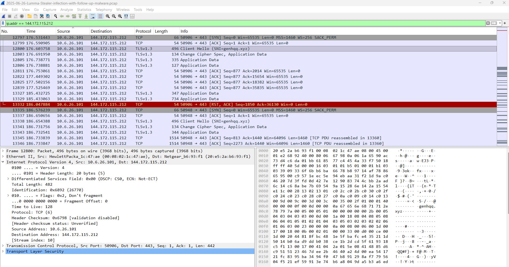

Filtering traffic for IP address **144.172.115.212** reveals the complete TCP session established by the infected host. After the TCP three-way handshake, the client initiates a TLS connection containing the Server Name Indication (SNI) **genhqq.xyz**, confirming communication with the malware's Command-and-Control infrastructure.

---

## TLS Handshake (SNI)

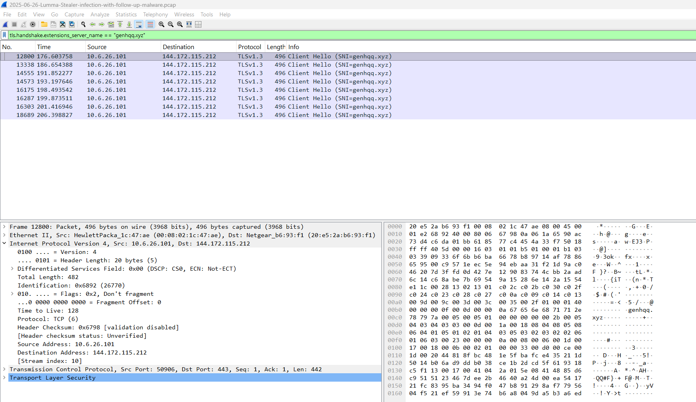

Filtering TLS Client Hello packets by Server Name Indication shows repeated connections to **genhqq.xyz**. Multiple TLS handshakes indicate persistent communication attempts with the Command-and-Control server during the infection.

---

## Follow TCP Stream

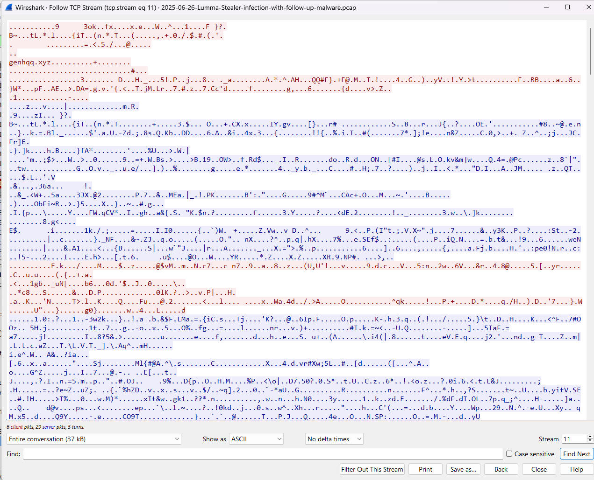

The TCP stream shows encrypted TLS application data exchanged between the infected host and the remote server. Although the payload cannot be decrypted without session keys, the stream clearly exposes the hostname **genhqq.xyz**, confirming the destination used by the malware.

---

## I/O Graph

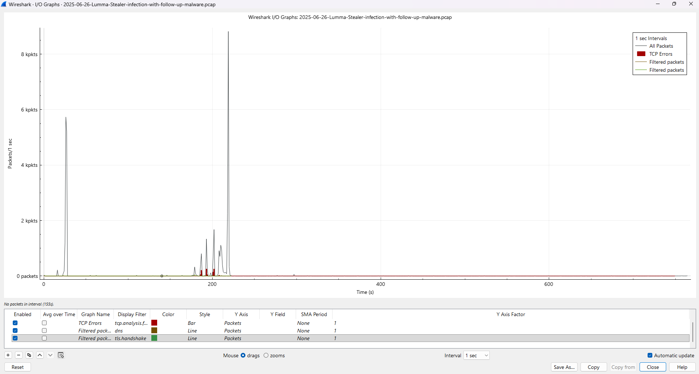

The Wireshark I/O Graph visualizes packet activity during the infection. Noticeable traffic spikes correspond to malware communication and encrypted data transfer with the remote infrastructure.

---

## Protocol Hierarchy (Filtered TLS Session)

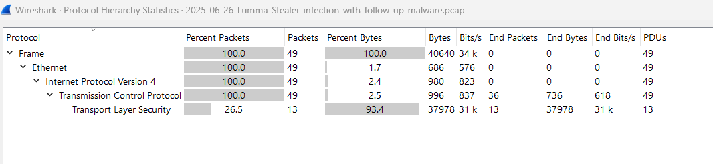

After filtering the malicious session, the Protocol Hierarchy confirms that most transferred bytes belong to the TLS protocol. This demonstrates that the malware uses encrypted communication over TCP.

---

## TLS Handshake Details

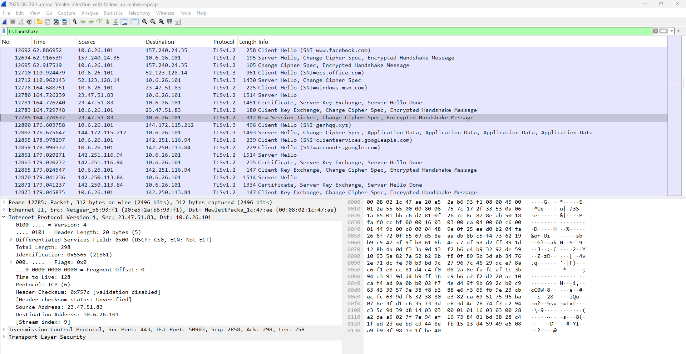

The TLS handshake shows the Client Hello message sent by the infected workstation. The Server Name Indication (SNI) field exposes the domain **genhqq.xyz**, allowing identification of the destination despite encryption.

---

## TCP Sequence Graph

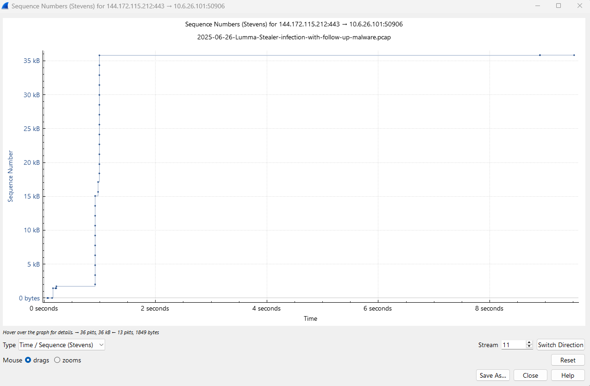

The TCP Time-Sequence graph illustrates the progression of data transmitted during the encrypted session. A rapid increase in sequence numbers indicates successful data exchange between the infected host and the Command-and-Control server.

---

## Exported HTTP Objects

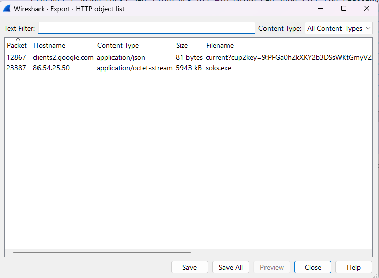

Exporting HTTP objects reveals the downloaded malware payload **soks.exe** from host **86.54.25.50**. This confirms the malware delivery stage of the infection chain.

---

## SMB Export Objects

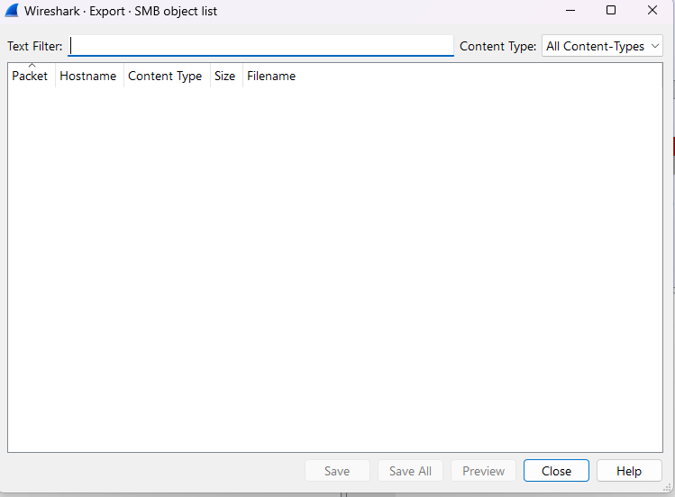

No SMB objects were identified within the capture, indicating that SMB was not used during the observed infection.

---

## DICOM Export Objects

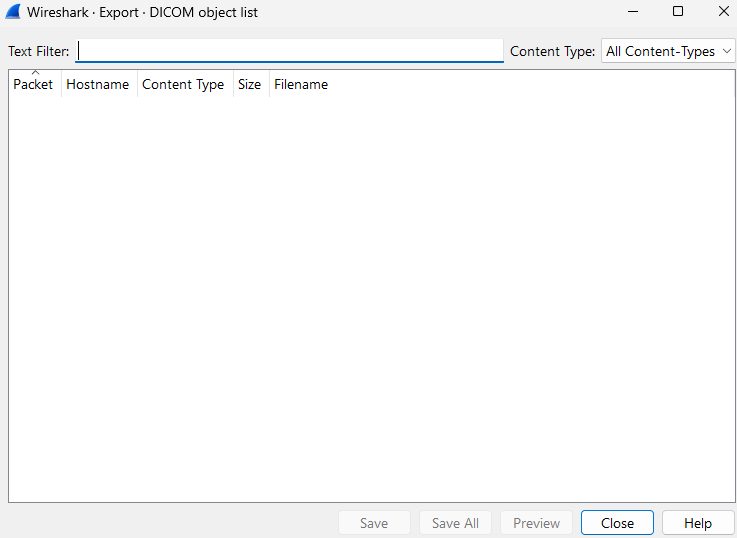

No DICOM traffic was detected during the capture.

---

## TFTP Export Objects

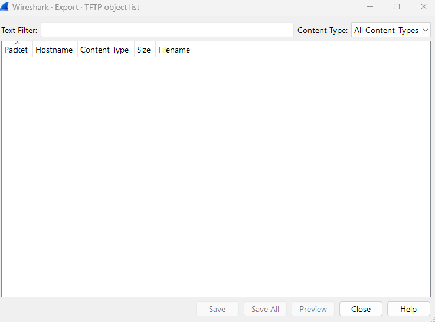

No TFTP objects were present, indicating that the malware did not use this protocol.

---

## Expert Information

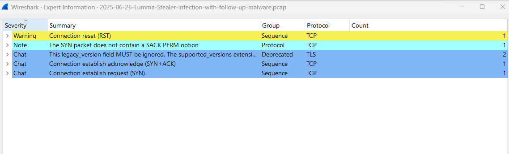

Wireshark Expert Information reports only minor TCP events such as SYN, SYN/ACK, and one TCP reset. No significant protocol anomalies were detected beyond normal connection establishment and termination.

---

## Indicators of Compromise Table

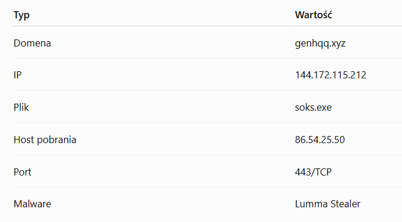

The extracted Indicators of Compromise summarize the key artifacts discovered during the analysis, including the malicious domain, Command-and-Control IP address, downloaded payload, and transport protocol.

---

## DNS Query

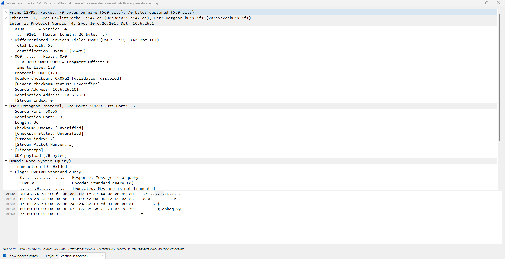

The DNS query shows the infected workstation resolving **genhqq.xyz** before establishing the encrypted TLS session. This confirms the domain lookup preceding communication with the malicious infrastructure.

---

## TCP Communication Endpoints

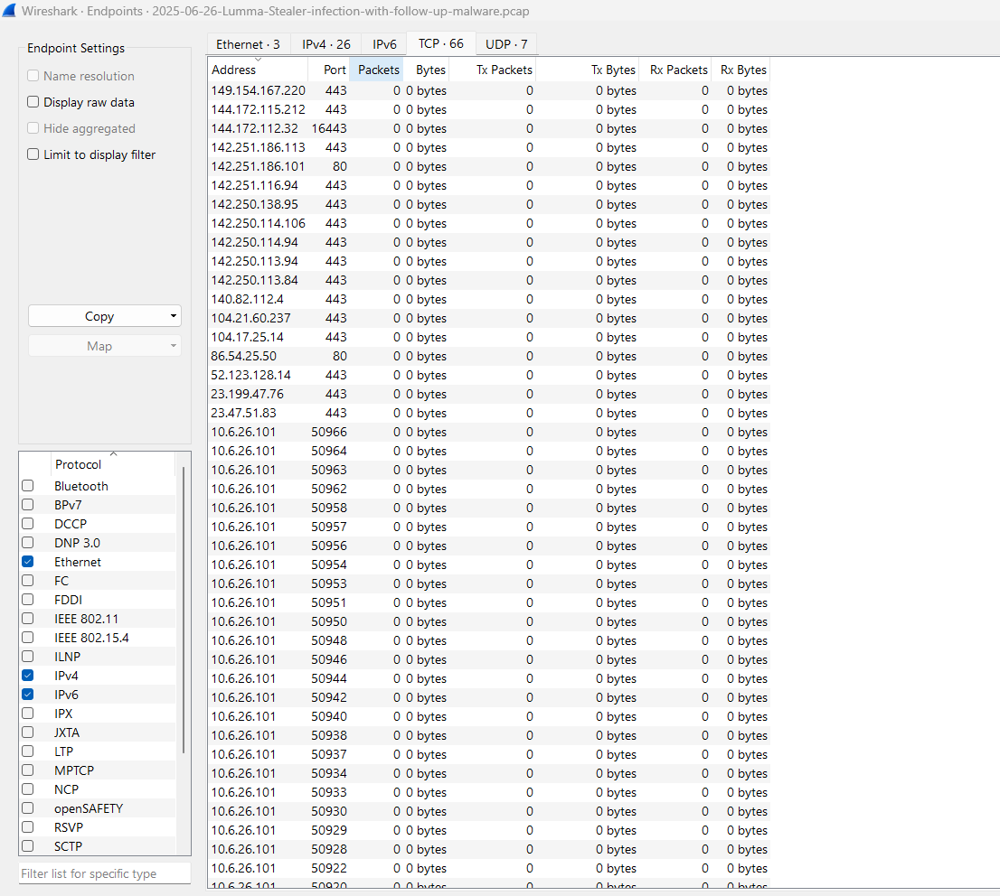

The TCP Endpoints view lists all TCP connections established during the malicious session. It confirms communication between the infected workstation and multiple external hosts, including the malicious Command-and-Control server and the payload download server.

---

## Detection Opportunities

- DNS monitoring for suspicious domains
- TLS SNI inspection
- Detect outbound HTTPS to rare domains
- Monitor executable downloads over HTTP
- Block known malicious IoCs

---

## MITRE ATT&CK Mapping

| Tactic | Technique | Description |
|---------|-----------|-------------|
| Command and Control | T1071.001 | Web Protocols (HTTPS) |
| Command and Control | T1573 | Encrypted Channel (TLS) |
| Command and Control | T1105 | Ingress Tool Transfer |
| Discovery | T1016 | System Network Configuration Discovery (network communication observed) |

---

## Infection Timeline

1. Victim performs DNS lookup for **genhqq.xyz**
2. TCP three-way handshake
3. TLS Client Hello (SNI = genhqq.xyz)
4. Encrypted communication established
5. Malware downloads **soks.exe**
6. Persistent encrypted communication with C2

---

# Conclusion

This analysis demonstrates a typical Lumma Stealer infection chain, beginning with DNS resolution, followed by encrypted TLS communication with the Command-and-Control (C2) server, and ending with retrieval of the malware payload over HTTP. The infected workstation first resolves the malicious domain **genhqq.xyz**, establishes encrypted TLS sessions with the C2 server (**144.172.115.212**), and retrieves the malware payload **soks.exe** from **86.54.25.50**.

Although TLS encryption prevents inspection of the application payload, Wireshark provides sufficient network metadata—including DNS queries, Server Name Indication (SNI), IP addresses, TCP sessions, and exported HTTP objects—to identify the malicious infrastructure and reconstruct the attack timeline.

The recovered Indicators of Compromise (IoCs) can be used for threat hunting, intrusion detection, malware detection, and incident response activities.

---
## License

This project is intended for educational and malware analysis purposes only.

---
## Author

**Agata Gabara**

- GitHub: https://github.com/ag48665
- LinkedIn: https://www.linkedin.com/in/agatha-gabara-06494a37/
